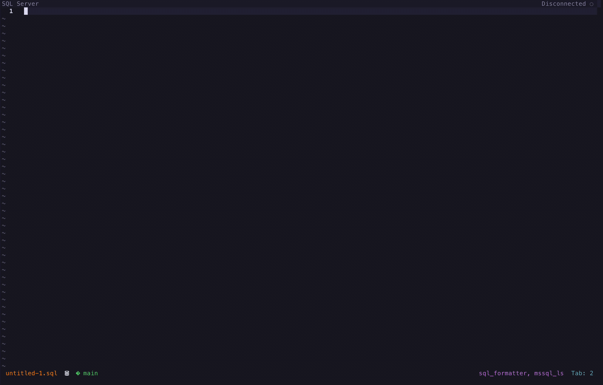

# sqlserver.nvim

[](https://neovim.io)
[](#installation)
[](https://github.com/NicholasMata/sqlserver.nvim/releases)
[](https://github.com/NicholasMata/sqlserver.nvim/actions/workflows/test.yml)
[](#documentation)
[](LICENSE)

<p align="center">
  
</p>

Stay in Neovim for the daily SQL Server workflow—from connecting and exploring
objects to executing T-SQL and inspecting results.

`sqlserver.nvim` is a SQL Server-native workspace built around Neovim rather
than an attempt to reproduce SQL Server Management Studio. It uses Microsoft
SQL Tools Service for SQL Server-aware language intelligence and query
execution while keeping protocol, workspace, result, and UI concerns separate.

## Features

- Connect query buffers to SQL Server and Azure SQL profiles.
- Complete, diagnose, format, hover, navigate, and inspect T-SQL signatures
  through Neovim's built-in LSP support and SQL Tools Service.
- Search and script tables, views, procedures, and functions in the connected
  database.
- Execute the statement under the cursor, a visual selection, or the complete
  buffer.
- Cancel active queries and inspect persistent workspace activity.
- Revisit recent executions and navigate their result sets in dedicated
  `sqlserver-result` buffers.
- Open CSV, JSON, and XML exports as editable buffers, or save Excel `.xlsx`.
- Copy selected result ranges as rich HTML tables for apps such as Teams.
- Display workspace state and result-history position in a configurable winbar.

Switching from `mssql.nvim` requires configuration and workflow changes. See
[Migrating from mssql.nvim](docs/migrating-from-mssql.md) for a compatibility
guide and checklist.

## Installation

Requires Neovim 0.11.7 or newer. With [lazy.nvim](https://github.com/folke/lazy.nvim):

```lua
{
  "NicholasMata/sqlserver.nvim",
  opts = {
    keymap_prefix = "<leader>s",
  },
}
```

The tested SQL Tools Service release is pinned and installed automatically on
first setup unless `tools_file` points to an existing executable. Override
`tools_version` only when intentionally testing another upstream release.
Create or edit connection profiles with:

```vim
:SQLServer EditConnections
```

See [Connections JSON](docs/connections-json.md) for the supported connection
properties and `${ENVIRONMENT_VARIABLE}` credential references.

## Configuration

The defaults provide a split result view, persistent activity, native progress,
and a winbar showing the current server, database, and state:

```lua
require("sqlserver").setup({
  keymap_prefix = "<leader>s",
  open_results_in = "split",
  view_messages_in = "activity",
  results = {
    sticky_header = true,
    history_limit = 10,
    max_rows = 100,
    max_cell_width = 100,
  },
  timeouts = {
    lsp_attach = 10000,
    connection = 10000,
    export = 10000,
    object_explorer = 10000,
    query = false,
  },
  ui = {
    presenter = "default",
    winbar = true,
    native_progress = true,
    height = 12,
  },
})
```

Operational timeouts use milliseconds or `false` to wait indefinitely. Queries
have no client-side timeout by default and can be stopped with `CancelQuery`.

With the prefix above, use `<leader>sx` for the statement under the cursor or a
visual selection, and `<leader>sX` for the complete buffer. Commands are also
available through `:SQLServer`.

## Documentation

| Goal | Guide |
| --- | --- |
| Install and configure the plugin | [Configuration](docs/configuration.md) |
| Create secure connection profiles | [Connection profiles](docs/connections-json.md) |
| Execute queries and work with results | [Usage](docs/usage.md) |
| Configure SQL formatting and IntelliSense | [SQL Tools Service settings](docs/lsp-settings.md) |
| Automate the plugin from Lua | [Public Lua API](docs/public-api.md) |
| Move from `mssql.nvim` | [Migrating from mssql.nvim](docs/migrating-from-mssql.md) |
| Understand the project direction | [Vision](docs/vision.md) and [roadmap](docs/roadmap.md) |
| Understand module ownership | [Architecture](docs/architecture.md) |
| Develop and test locally | [Contributing](CONTRIBUTING.md) |
| Prepare a release | [Release checklist](docs/releasing.md) |
| Review user-visible changes | [Changelog](CHANGELOG.md) |

## Contributing

Run `make test` for unit tests and `make lint` for formatting verification before
submitting changes. See [CONTRIBUTING.md](CONTRIBUTING.md) for the complete local
test environment, Docker integration workflow, coding style, and commit-message
rules. Maintainers use the [release checklist](docs/releasing.md) for automated
and manual `1.0.0` acceptance.
