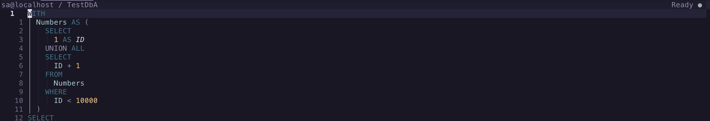

# Configuration

Call `setup()` once from your plugin manager or Neovim configuration. Setup is
asynchronous because SQL Tools Service may need to be installed; an optional
second argument runs after initialization.

## Defaults

Every supported option and its default is shown below. You only need to include
values you want to change.

```lua
require("sqlserver").setup({
  keymap_prefix = nil,
  open_results_in = "split",
  view_messages_in = "activity",

  ui = {
    presenter = "default",
    object_picker = "auto",
    object_explorer = {},
    winbar = true,
    native_progress = true,
    activity = {
      height = 12,
    },
    connection_info = {
      height = "auto",
    },
  },

  results = {
    column_icons = true,
    cell_navigation = true,
    highlight_current_cell = false,
    sticky_header = true,
    history_limit = 10,
    max_rows = 1000,
    max_cell_width = 100,
  },

  timeouts = {
    lsp_attach = 10000,
    connection = 10000,
    export = 10000,
    object_explorer = 10000,
    query = false,
  },

  execute_generated_select_statements = true,

  lsp_settings = {
    format = {
      placeSelectStatementReferencesOnNewLine = true,
      keywordCasing = "Uppercase",
      datatypeCasing = "Uppercase",
      alignColumnDefinitionsInColumns = true,
    },
  },

  sql_buffer_options = {
    expandtab = true,
    tabstop = 4,
    shiftwidth = 4,
    softtabstop = 4,
  },

  connections_file = nil,
  tools_file = nil,
  tools_version = "6.0.20260902.1",
  data_dir = vim.fs.joinpath(vim.fn.stdpath("data"), "sqlserver.nvim"),
}, function()
  -- sqlserver.nvim is ready.
end)
```

## Option reference

Durations are expressed in milliseconds. A timeout value of `false` waits
indefinitely.

| Option | Default | Description |
| --- | --- | --- |
| `keymap_prefix` | `nil` | Prefix for the default mappings. `nil` creates no mappings. |
| `open_results_in` | `"split"` | Opens results in `"split"`, `"vsplit"`, `"current_window"`, or with `function(bufnr)`. |
| `view_messages_in` | `"activity"` | Sends SQL messages to `"activity"`, `"notification"`, `"buffer"`, or `function(message, is_error, error_selection)`. The optional selection uses zero-based document positions. |
| `ui.presenter` | `"default"` | Uses the built-in presenter, `false` for none, or `function(workspace, event)` for a custom primary subscriber. |
| `ui.object_picker` | `"auto"` | Uses the dedicated Snacks picker when available and otherwise `vim.ui.select`. Set `"select"`, `"snacks"`, or `function(context, callback)` to choose explicitly. |
| `ui.object_explorer` | `{}` | Snacks picker options merged into the Object Explorer's persistent sidebar configuration. |
| `ui.winbar` | `true` | Enables the default winbar. Use `false` or a table with `layout`, `alignment`, and `identity` to customize it. |
| `ui.winbar.layout` | `"split"` | With the object form, uses `"split"` or `"compact"` content. |
| `ui.winbar.alignment` | `"right"` | With the compact layout, aligns content `"left"`, `"center"`, or `"right"`. |
| `ui.winbar.identity` | `{ "username", "server", "database" }` | Chooses and orders connection fields. Adjacent username and server fields render as `username@server`. |
| `ui.native_progress` | `true` | Publishes active and completed operations through Neovim's built-in progress messages. |
| `ui.activity.height` | `12` | Height of the built-in Activity split. |
| `ui.connection_info.height` | `"auto"` | Height of the Connection Information split. `"auto"` fits its content up to half the source-window height; a positive integer uses a fixed height. |
| `results.column_icons` | `true` | Prefixes result headers with colored Nerd Font icons for SQL type families. Use `false` to disable them or a table to override individual glyphs. |
| `results.cell_navigation` | `true` | Uses `h`, `j`, `k`, and `l` as semantic cell motions in result buffers. Use `false` to disable it or `{ wrap = false }` to stop horizontal movement at table boundaries. Arrow keys retain native text movement. |
| `results.highlight_current_cell` | `false` | Highlights the semantic result cell under the cursor when enabled. `SqlServerResultCurrentCell` links to `Search` unless overridden by the user. |
| `results.sticky_header` | `true` | Keeps the column header visible while scrolling through result rows. |
| `results.history_limit` | `10` | Successful executions retained in memory for each SQL source buffer. |
| `results.max_rows` | `1000` | Maximum rows fetched for each result set. |
| `results.max_cell_width` | `100` | Maximum displayed cell width. The underlying value remains unchanged. |
| `timeouts.lsp_attach` | `10000` | Maximum wait for SQL Tools Service to attach to a SQL buffer. |
| `timeouts.connection` | `10000` | Maximum wait for a connection or disconnection operation. |
| `timeouts.export` | `10000` | Maximum wait for SQL Tools Service to finish writing an exported result. |
| `timeouts.object_explorer` | `10000` | Maximum wait for an object metadata refresh or scripting request. |
| `timeouts.query` | `false` | Maximum query duration before server-side cancellation is requested. |
| `execute_generated_select_statements` | `true` | Immediately executes generated table and view queries. Procedures are never executed automatically. |
| `lsp_settings` | See defaults above | Settings passed directly to SQL Tools Service. |

Result header icons classify the SQL type metadata already returned with each
query. They do not request full schema metadata or infer keys and indexes. Set
only the glyphs you want to replace; omitted values retain their defaults:

```lua
require("sqlserver").setup({
  results = {
    column_icons = {
      text = "󰀬",
      number = "󰎠",
      boolean = "󰔡",
      temporal = "󰃭",
      json = "󰘦",
      uuid = "󰯮",
      binary = "󰈔",
      unknown = "󰠵",
      nullable = "ˀ",
    },
  },
})
```

The icon highlight groups link to standard Neovim groups and follow the active
color scheme. Override groups such as `SqlServerResultTypeText`,
`SqlServerResultTypeNumber`, or `SqlServerResultTypeTemporal` with
`vim.api.nvim_set_hl()` when desired. Nullable columns place the configurable
`nullable` marker beside the type icon and use `SqlServerResultNullable`.
| `sql_buffer_options` | See defaults above | Neovim buffer options applied to SQL buffers. |
| `connections_file` | `nil` | Connection-profile JSON path. `nil` uses `data_dir/connections.json`. |
| `tools_file` | `nil` | Existing SQL Tools Service executable. `nil` uses the managed installation. |
| `tools_version` | `"6.0.20260902.1"` | Pinned managed SQL Tools Service release. Changing it triggers a staged reinstall. |
| `data_dir` | `stdpath("data") .. "/sqlserver.nvim"` | Stores the managed service, connection profiles, logs, and internal state. |

When another distribution overwrites mappings after setup, install them later
with `require("sqlserver").set_keymaps(prefix)`. Connection profile fields and
environment-variable references are documented in
[Connections JSON](connections-json.md).

## Presentation

`ui.winbar = true` uses the split layout, with
`username@server / database` on the left and status on the right. The username
comes from SQL Tools Service and is omitted when unavailable. Long server names
are shortened first so the username, database, and status remain visible.
Result buffers use the same native winbar area to show their source buffer,
execution position, and result-set position. The object form provides workspace
layout and identity control:

<p align="center">
  
</p>

```lua
ui = {
  winbar = {
    layout = "compact", -- "compact" or "split"
    alignment = "right", -- "left", "center", or "right"
    identity = { "username", "server", "database" },
  },
}
```

`identity` accepts each of `"username"`, `"server"`, and `"database"` at
most once. Remove or reorder fields to suit narrow windows; an empty list uses
the generic `SQL Server` label beside workspace status.

Connection metadata is available through `:SQLServer ConnectionInfo`. The
Activity buffer is reserved for operations and messages.

The state icon links to standard Neovim highlight groups. Override its colors
with `SqlServerReady`, `SqlServerWorking`, `SqlServerCancelling`, and
`SqlServerDisconnected`:

```lua
vim.api.nvim_set_hl(0, "SqlServerReady", { fg = "#98c379" })
vim.api.nvim_set_hl(0, "SqlServerWorking", { fg = "#61afef" })
vim.api.nvim_set_hl(0, "SqlServerCancelling", { fg = "#e5c07b" })
vim.api.nvim_set_hl(0, "SqlServerDisconnected", { fg = "#5c6370" })
```

Statusline integrations can call `require("sqlserver").status()`. Independent
secondary consumers can subscribe without replacing the primary presenter:

```lua
local unsubscribe = require("sqlserver").subscribe_activity(function(workspace, event)
  -- Observe or present the structured event.
end)

unsubscribe()
```

Object selection defaults to `"auto"`. It uses sqlserver.nvim's richer Snacks
layout when `snacks.nvim` is available and otherwise delegates to
`vim.ui.select`. The provider is resolved once during setup, so it remains
stable for the Neovim session. To choose explicitly:

```lua
ui = {
  object_picker = "snacks",
}
```

Use `"select"` to always delegate to `vim.ui.select`, including its globally
configured provider.

A custom picker receives a stable context and must call its callback with one
of the provided items, or `nil` when cancelled:

```lua
ui = {
  object_picker = function(context, callback)
    -- context.title
    -- context.items: id, label, path, icon, and object
    callback(context.items[1]) -- or callback(nil)
  end,
}
```

The hierarchical Object Explorer is separate from object selection and
requires `snacks.nvim` with its picker enabled. Snacks remains optional for
every other sqlserver.nvim workflow. Override its sidebar picker configuration
through `ui.object_explorer`, for example:

```lua
ui = {
  object_explorer = {
    layout = { preset = "right", preview = false },
  },
}
```

See [Object Explorer](object-explorer.md) for its mappings, lazy-loading model,
search behavior, supported object scope, and screenshot.

## SQL Tools Service

`lsp_settings` is passed directly to SQL Tools Service. See
[LSP Settings](lsp-settings.md) for the available formatting configuration.
Neovim options in `sql_buffer_options` are applied to every SQL buffer.

Managed service updates are extracted and validated in staging before replacing
the active version, so a failed update preserves the previous working
installation. A custom `tools_file` must be readable and executable.

See [Usage](usage.md) for commands, mappings, query execution, result
navigation, activity, language features, and object workflows.
