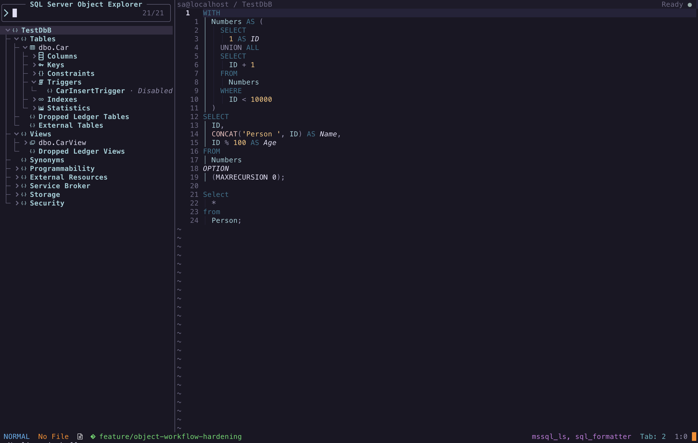

# Object Explorer

Object Explorer presents the hierarchy returned by SQL Tools Service in a
persistent Snacks sidebar. It belongs to the current SQL buffer's connection
and preserves service-defined folders, ordering, and object relationships
instead of flattening them into a plugin-specific structure.

<p align="center">
  
</p>

## Requirements and opening

Object Explorer requires
[snacks.nvim](https://github.com/folke/snacks.nvim) with its picker enabled.
Snacks remains optional for every other sqlserver.nvim workflow.

Connect a SQL buffer, then run:

```vim
:SQLServer ObjectExplorer
```

With `keymap_prefix = "<leader>s"`, the default mapping is `<leader>sb`.
Opening Object Explorer again for the same SQL buffer focuses the existing
sidebar.

## Hierarchy and loading

The initial tree contains the root and the children SQL Tools Service returns
for it. Expanding a node requests its children lazily. This keeps startup fast
and avoids requesting an entire large database before it is needed.

Loaded nodes remain cached for the lifetime of the explorer session. A node
that SQL Tools Service reports as expandable keeps its disclosure marker until
its first expansion. If the service returns no children, the marker is removed.

Every server-backed expansion participates in the shared workspace activity
lifecycle. Slow loads, failures, cancellation, disconnection, and workspace
disposal are therefore handled consistently with other asynchronous plugin
operations. Activity entries include the full hierarchy, such as
`Object Explorer · TestDbB › Tables › dbo.Car › Columns · Loaded`, while the
workspace winbar uses a shorter status.

## Mappings

Press `?` in Normal mode to open Snacks' built-in mapping help.

| Vim Mode | Mapping | Command | Description |
| --- | --- | --- | --- |
| Normal | `<CR>` | Snacks `confirm` | Build a runnable query for an object, or toggle a structural node |
| Normal | `K` | `object_actions` | Open contextual actions for the selected object |
| Normal | `c` | `object_cancel_search` | Cancel an active full-tree search load |
| Normal | `l` | `object_toggle` | Expand or collapse a node, lazily loading details |
| Normal | `h` | `object_collapse` | Collapse the current node or its parent |
| Normal | `L` | `object_expand_all` | Expand the complete tree, loading details as needed |
| Normal | `H` | `object_collapse_all` | Return to the compact root outline |
| Normal | `d` | `object_definition` | Open the selected object's editable definition |
| Normal | `r` | `object_refresh` | Refresh the complete metadata snapshot and redraw the tree |
| Normal | `q` | Snacks `cancel` | Close Object Explorer |

## Searching

Typing in the picker searches every currently loaded node, including nodes
hidden below collapsed branches. The filtered tree preserves service order and
shows only matching nodes and the ancestors needed to locate them.

If unopened nodes remain, every search begins with a selectable
`Search all objects…` row. When no loaded node matches,
`No matching loaded objects` appears beneath it. Selecting Search All traverses
the remaining hierarchy through the normal asynchronous lifecycle, caches the
loaded nodes, and reruns the current search. Progress remains visible in the
explorer.

Press `c` in Normal mode to cancel Search All. Cancellation is cooperative: the
active SQL Tools Service expansion finishes, then traversal of the remaining
nodes stops. Nodes already loaded remain cached. Once the complete hierarchy is
cached, a search with no match displays `No matching objects`.

## Object actions

Press `K` on an object to open a compact Snacks action menu beside the current
tree row. Tables and views offer **Select rows**, procedures offer
**Create execution script**, and functions offer **Create query script**.
Every supported object also offers **Show definition**, **Copy name**,
**Copy qualified name**, and **Refresh details**. `<CR>` remains the fast
default query or execution-script action.

Generated table and view queries execute immediately by default. Procedure
scripts are inserted but never executed automatically because they may have
side effects. Definitions open in dedicated editable SQL buffers. Existing
definition-buffer collisions use the same focus-or-create workflow as
`:SQLServer ObjectDefinition`.

## Supported scope

Object Explorer deliberately covers query and object-scripting workflows
rather than SQL Server administration. Actionable objects are tables, views,
stored procedures, scalar-valued functions, and table-valued functions. Their
folder placement and ordering come from SQL Tools Service.

Expandable objects display every child returned by the service. With the
pinned release, tables can expose Columns, Keys, Constraints, Indexes,
Statistics, and Triggers. Available children vary by object type, server
capabilities, and permissions. Empty child collections are treated as valid,
and unknown future child types remain visible with a generic icon. When SQL
Tools Service supplies a node subtype, status, or error, the explorer appends
that information as a muted annotation; nodes with service errors use the
standard diagnostic-error highlight. These annotations are searchable.

Object scripting participates in the same cancellable lifecycle as queries.
Use `<keymap_prefix>l`, `:SQLServer CancelOperation`, or `sqlserver.cancel()`
while a script is being generated. Cancellation is sent to SQL Tools Service,
and scripting plan and progress notifications update the existing operation.

Server-administration branches such as Security, Storage, Service Broker, and
SQL Server Agent are outside the current Object Explorer scope.

## Configuration

Pass Snacks picker options through `ui.object_explorer`. For example, to put
the sidebar on the right:

```lua
require("sqlserver").setup({
  ui = {
    object_explorer = {
      layout = { preset = "right", preview = false },
    },
  },
})
```

Object Explorer requests use `timeouts.object_explorer`, which defaults to
10,000 milliseconds. Set it to `false` to wait indefinitely. See
[Configuration](configuration.md) for the complete option reference.
