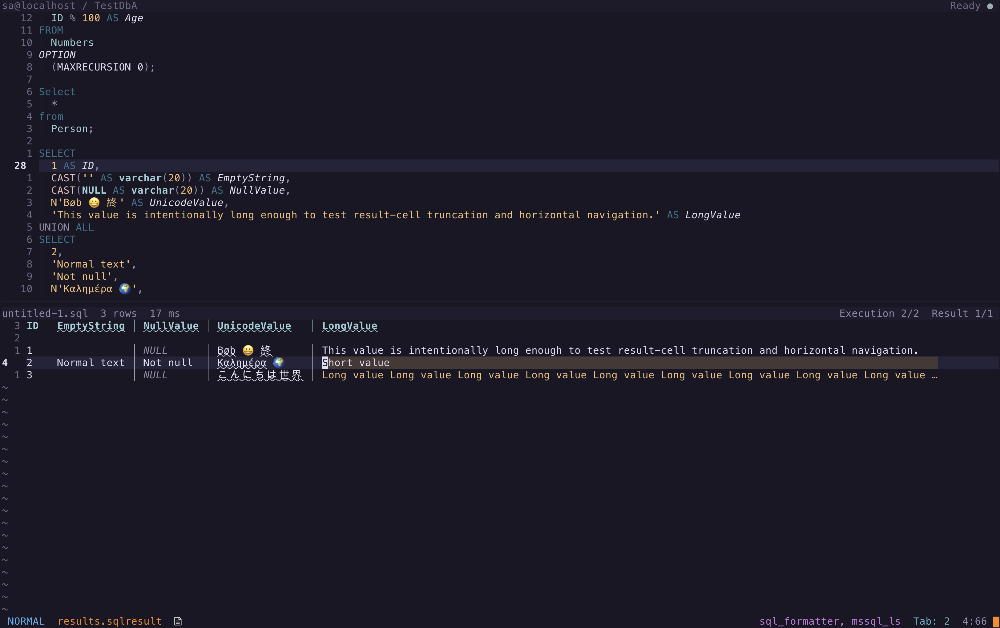
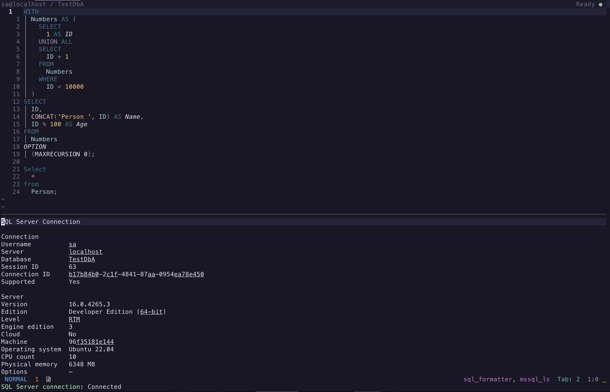

# Usage

`sqlserver.nvim` commands use the form `:SQLServer <command>`. When
`keymap_prefix` is configured, the mappings below are added after that prefix.
Command completion includes only actions valid for the current workspace state.

## Workspace layout

<p align="center">
  
</p>

| Label | Term | Meaning |
| --- | --- | --- |
| 1 | Query buffer | Editable `sql` buffer that owns its connection, active execution, and retained result history |
| 2 | Workspace winbar | Neovim's built-in per-window bar showing the connected server, database, and current state |
| 3 | Result view | Reusable Neovim window displaying one `sqlserver-result` buffer at a time |
| 4 | Result winbar | Identifies the source query and the active execution and result-set positions |
| 5 | Column header | Real first buffer row; a non-focusable sticky copy remains visible when this row scrolls away |

A buffer owns text and plugin state; a window displays a buffer. Query and
result buffers remain tied together even when either buffer is hidden or shown
in a different window. One query execution can produce several result sets, and
each result set has its own result buffer. A retained sequence of those
executions is the query buffer's result history.

## SQL buffer workflow

| Vim Mode | Mapping | Command | Behavior |
| --- | --- | --- | --- |
| Normal | `<keymap_prefix>n` | `NewQuery` | Open a new SQL query buffer |
| Normal | `<keymap_prefix>d` | `NewDefaultQuery` | Open a query using the `default` connection profile |
| Normal | `<keymap_prefix>e` | `EditConnections` | Edit connection profiles |
| Normal | `<keymap_prefix>c` | `Connect` | Connect the current query buffer |
| Normal | `<keymap_prefix>R` | `Reconnect` | Retry the query buffer's previous connection |
| Normal | `<keymap_prefix>q` | `Disconnect` | Disconnect the current query buffer |
| Normal | `<keymap_prefix>s` | `SwitchDatabase` | Change database on the connected server |
| Normal | `<keymap_prefix>x` | `ExecuteQuery` | Execute the statement under the cursor |
| Visual | `<keymap_prefix>x` | `ExecuteQuery` | Execute the selected text |
| Normal | `<keymap_prefix>X` | `ExecuteBuffer` | Execute the complete buffer |
| Normal | `<keymap_prefix>l` | `CancelOperation` | Cancel the active query or object script |
| Normal | `<keymap_prefix>v` | `ShowResults` | Reopen the active retained execution |
| Normal | `<keymap_prefix>f` | `Find` | Build a query for a selected database object |
| Normal | `<keymap_prefix>o` | `ObjectDefinition` | Open a selected database object's definition |
| Normal | `<keymap_prefix>b` | `ObjectExplorer` | Browse database objects in a hierarchical Snacks sidebar |
| Normal | `<keymap_prefix>r` | `RefreshCache` | Refresh object and IntelliSense metadata |
| Normal | `<keymap_prefix>a` | `Activity` | Toggle workspace activity |
| Normal | `<keymap_prefix>i` | `ConnectionInfo` | Show connection and server information |

If a disconnected query is executed, the plugin attempts to use the connection
profile named `default`. Current-statement parsing is delegated to SQL Tools
Service.

The workspace winbar and activity stream show background phases such as
`Starting SQL Tools Service`, `Connecting`, `Loading database objects`,
`Executing query`, `Loading query results`, and `Rendering query results`.
Interactive prompts and object pickers do not start a timer; timing begins only
when backend work starts. Generated buffers are displayed after their contents
are ready, so the current window remains unchanged when preparation fails.

## Result view workflow

Every SQL source buffer retains its own recent successful executions in memory.
Each execution can contain one or more `sqlserver-result` buffers, displayed in
a reusable results window. Unless noted otherwise, these mappings run from a
result buffer:

<p align="center">
  
</p>

Column headers use colored Nerd Font icons to identify text, number, boolean,
temporal, JSON, UUID, binary, and unknown SQL type families. These icons are
display-only: column names, copied values, and exported data remain unchanged.
Nullable columns add a compact `ˀ` marker beside the type icon.
Disable or customize them with `results.column_icons`. When spell checking is
enabled, result values remain checked while the column header is excluded.

| Vim Mode | Mapping | Command | Behavior |
| --- | --- | --- | --- |
| Normal, Visual | `h` / `l` | — | Move to the previous or next cell, wrapping between columns |
| Normal, Visual | `j` / `k` | — | Move within the same column on the next or previous row |
| Normal | `]r` | `NextResult` | Show the next result set in the execution |
| Normal | `[r` | `PreviousResult` | Show the previous result set in the execution |
| Normal | `<keymap_prefix>n` | `NextExecution` | Show the next retained execution |
| Normal | `<keymap_prefix>p` | `PreviousExecution` | Show the previous retained execution |
| Normal | `]c` | — | Move to the next result column |
| Normal | `[c` | — | Move to the previous result column |
| Normal | `K` | — | Inspect the current column's SQL type and metadata |
| Normal | `<keymap_prefix>d` | `RemoveResult` | Remove the current result after confirmation |
| Normal | `<keymap_prefix>s` | `ExportQueryResults` | Export the complete result set |
| Visual | `<keymap_prefix>s` | `ExportQueryResults` | Export the selected rows and columns |
| Visual | `<keymap_prefix>y` | — | Copy the selected cells as a rich HTML table |
| Normal | — | `CopyResultCell` | Copy the complete value under the cursor; command only |

Cell motions accept Vim counts, keep the current column while moving between
rows, and skip the rendered header divider. Vertical movement stops at the
header or final data row; horizontal movement wraps to match `[c` and `]c`.
Arrow keys retain native character and line movement. Set
`results.cell_navigation = false` to leave `h`, `j`, `k`, and `l` unmapped.
The default `true` value is equivalent to `{ wrap = true }`; use
`results.cell_navigation = { wrap = false }` to stop `h`, `l`, `[c`, and `]c`
at the first and last columns instead.

Set `results.highlight_current_cell = true` to highlight the current semantic
cell, including header cells. The opt-in highlight is hidden during Visual mode
so it does not obscure the selected range. It includes the padding beside each
cell while leaving the vertical separators unhighlighted. By default,
`SqlServerResultCurrentCell` links to `Search`; customize it through the normal
Neovim highlight API:

```lua
vim.api.nvim_set_hl(0, "SqlServerResultCurrentCell", { link = "CursorColumn" })
```

For a more subdued highlight, link it to `CursorColumn`. Some color schemes
give `CursorColumn` and `CursorLine` the same background, which makes that
combination indistinguishable while result row highlighting is enabled.
Result windows disable Neovim's `list` option so alignment padding does not
appear as trailing-whitespace markers; other windows retain their own setting.

### Result history

Executing again activates a new execution without deleting older result
buffers. `results.history_limit` controls how many executions are retained for
each source buffer. Deleting the source buffer discards its complete history.

### Result winbar

The result winbar identifies the source SQL buffer and shows the current
execution, result-set position, row count, and elapsed time reported by SQL
Tools Service. For example, `query.sql  42 rows  38 ms` appears on the left,
while `Execution 2/4  Result 1/2` stays anchored on the right. A limited result
uses `100 of 10,000 rows` to distinguish displayed rows from the complete row
count. The time belongs to the SQL batch that produced the result, so results
from the same batch show the same time.

### Removing results

Removing a result selects the nearest remaining result. Removing the final
result in an execution removes that execution; removing the final retained
result also closes the results view.

### Columns and sticky header

Column inspection displays compact types such as `varchar(100) NULL` or
`decimal(12, 2) NOT NULL`, plus source-object metadata when SQL Tools Service
provides it. The sticky header keeps column names visible while scrolling and
can be disabled with `results.sticky_header = false`.

### Copying and exporting

Copy and export actions use complete underlying cell values rather than
display-width-truncated text. Rich HTML clipboard copy includes the selected
headings and uses native macOS and Windows facilities; Linux requires `wl-copy`
or `xclip`.

CSV, JSON, and XML exports open as modified, unsaved buffers. Edit them if
needed and use Neovim's normal `:write` command to save them. Binary Excel
`.xlsx` exports ask for a destination and write directly. Visual exports use
the rectangular range covered by the selection; linewise selections include
every column. Result mappings that use `keymap_prefix` are omitted when no
prefix is configured. Export progress covers SQL Tools Service serialization
and buffer preparation; successful text exports rely on the opened buffer and
do not produce an additional notification.

### Limits and value fidelity

When the configured row limit is reached, the buffer reports how many rows are
shown. Cell-width truncation affects only the rendered table. Database `NULL`
remains distinct from the string `"NULL"`, and Unicode, decimal, datetime,
binary, and invariant-culture values are preserved when SQL Tools Service
provides them.

### SQL errors and batches

Successful result sets are retained when another batch raises an error. Empty
result slots from failed batches are omitted, but surviving buffer names retain
their execution ordinal; if the first batch fails and the second succeeds, the
buffer is named `results 2.sqlresult`. Every SQL Server error also produces a
Neovim error notification.

Statements without a `GO` separator execute as one SQL Server batch. A
batch-terminating error may prevent later statements from running. Use `GO` to
run later statements as independent batches; the plugin does not silently
split T-SQL because that would change variable, transaction, temporary-table,
and other batch semantics.

### Cancellation and cleanup

An intentional cancellation remains in progress until SQL Tools Service
reports completion, after which the connected buffer can execute again. A
query timeout also requests server-side cancellation but leaves the workspace
disconnected because execution state cannot be confirmed. Use `Reconnect`
before running another query.

Connection, authentication, TLS, unreachable-server, timeout, and service
failures have distinct secret-safe messages. Detailed redacted diagnostics are
retained in activity history. Deleting a SQL buffer disposes its connection;
leaving Neovim stops plugin-owned SQL Tools Service clients.

## Activity view

| Vim Mode | Mapping | Command | Behavior |
| --- | --- | --- | --- |
| Normal | `q` | — | Close the activity view |

The Activity view contains chronological plugin operations, progress, SQL
messages, warnings, and errors. Connection metadata is kept in its own view so
the activity stream remains focused on what is happening.

A mixed query outcome uses a warning state while each underlying SQL error
remains an error; an error-only execution uses the failed state.
Each activity row includes its source, such as `Object Explorer · ApplicationDb
› Tables › dbo.Person › Columns · Loading` or `Query · Query completed`,
so concurrent asynchronous work remains distinguishable. Object Explorer
activity uses tree breadcrumbs while the winbar deliberately keeps the compact
`Loading database object` status.

## Connection information

Run `:SQLServer ConnectionInfo` from a connected SQL buffer to open a reusable,
read-only view of the current connection and the server metadata reported by
SQL Tools Service.

<p align="center">
  
</p>

| Vim Mode | Mapping | Command | Description |
| --- | --- | --- | --- |
| Normal | `r` | — | Refresh the view from the latest workspace connection state |
| Normal | `q` | — | Close the connection information view |
| Normal | `?` | — | Show the connection information mappings |

The view includes the resolved username, server, database, SQL Server session
ID, SQL Tools Service connection ID, supported-version status, server version,
edition, engine information, and available host details. It never displays a
password, access token, or connection string. Non-applicable server fields are
omitted, empty values render as `—`, and a visible view updates when connection
state changes.

## Language features

SQL Tools Service attaches through Neovim's standard LSP client, so existing
completion, diagnostics, hover, signature-help, definition, and formatting
integrations continue to work. Neovim identifies the client as `mssql_ls` in
LSP status and health output. For example:

```lua
vim.keymap.set("n", "K", vim.lsp.buf.hover)
vim.keymap.set("n", "gd", vim.lsp.buf.definition)
vim.keymap.set("i", "<C-s>", vim.lsp.buf.signature_help)
vim.keymap.set("n", "<leader>f", function()
  vim.lsp.buf.format({ async = true })
end)
```

Schema-aware results become available after connection and IntelliSense
readiness. `:SQLServer RefreshCache` rebuilds both object and IntelliSense
metadata for the current connection.

## Object workflow

The object picker searches a snapshot of tables, views, stored procedures,
scalar functions, and table-valued functions in the connected database. Its
actions are invoked from the SQL buffer and are listed in the SQL buffer
workflow table above.

Generated table and view queries execute immediately by default. Procedure
calls are inserted but never executed automatically because they may have side
effects. Definitions use `CREATE` scripting and open in dedicated editable SQL
buffers named `<schema>.<object>.sql`. If that name is already open, choose to
use the existing visible or hidden buffer, or create a numbered buffer such as
`dbo.Person (2).sql`. A deleted buffer is generated again without a collision
prompt.
Individual-node refresh and generic `ALTER`/`DROP` actions are outside the 1.0
scope.

When `snacks.nvim` is installed with its picker enabled,
`:SQLServer ObjectExplorer` opens a persistent, lazily loaded sidebar for the
current connection. See [Object Explorer](object-explorer.md) for its hierarchy,
mappings, search and cancellation behavior, contextual actions, supported
scope, screenshot, and configuration.

## Command reference

| Command | Purpose |
| --- | --- |
| `Activity` | Toggle workspace activity |
| `ConnectionInfo` | Show connection and server information |
| `Connect` | Connect the current query buffer |
| `Reconnect` | Retry the query buffer's previous connection |
| `Disconnect` | Disconnect the current query buffer |
| `ExecuteQuery` | Execute the statement under the cursor or selected text |
| `ExecuteBuffer` | Execute the complete buffer |
| `CancelOperation` | Cancel the active query or object script |
| `CancelQuery` | Compatibility alias for `CancelOperation` |
| `NewQuery` | Open a query buffer |
| `NewDefaultQuery` | Open a query using the `default` profile |
| `SwitchDatabase` | Change database on the current server |
| `Find` | Build a runnable query for a database object |
| `ObjectDefinition` | Script a database object's definition |
| `ObjectExplorer` | Browse the current database in a hierarchical Snacks sidebar |
| `RefreshCache` | Refresh metadata and IntelliSense caches |
| `EditConnections` | Edit connection profiles |
| `ExportQueryResults` | Export the current result set |
| `ShowResults` | Focus or reopen the current SQL buffer's active execution |
| `NextResult` | Display the next result set |
| `PreviousResult` | Display the previous result set |
| `NextExecution` | Display the next retained execution |
| `PreviousExecution` | Display the previous retained execution |
| `RemoveResult` | Remove the current result set and any execution it leaves empty |
| `CopyResultCell` | Copy the complete value under the cursor from a result set |
| `BackupDatabase` | Insert a database backup command |
| `RestoreDatabase` | Insert a database restore command |

See [Configuration](configuration.md) for setup options and UI customization,
and [Public Lua API](public-api.md) for UI-independent automation.
